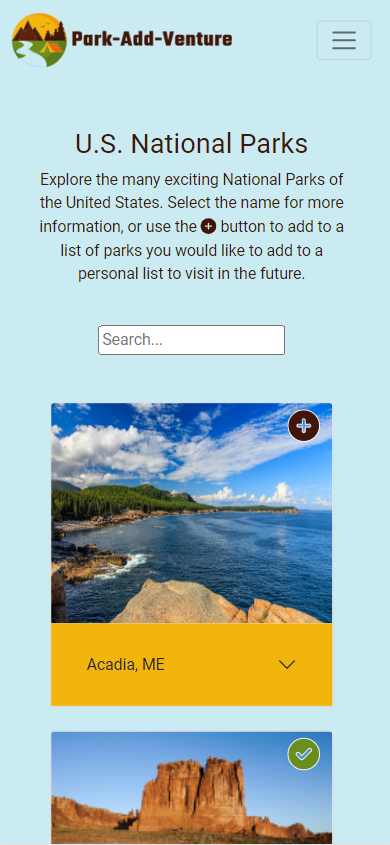
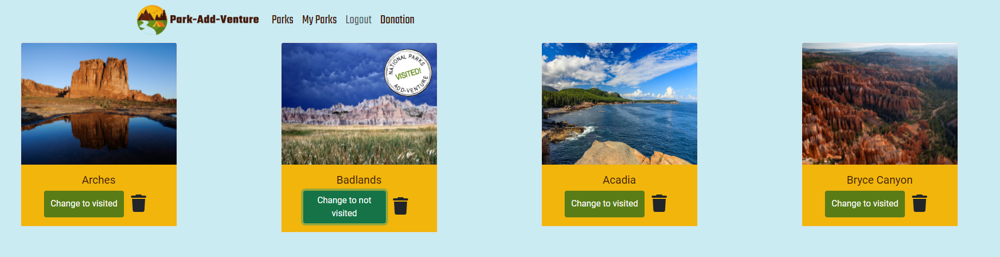
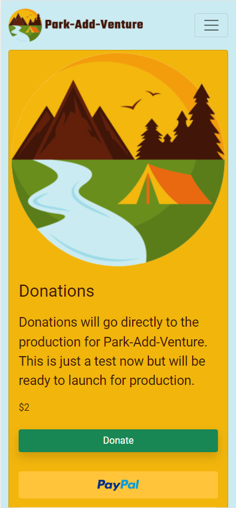

# Park-Add-Venture

## Description

Park-Add-Venture is a single page application that promotes users to get outside and explore America's National Parks. The homepage allows a user to view all US National Parks. Once the user has signed up, they are logged in. A logged in user has the ability to add parks that they would like to visit, mark a park as visited, and delete a park if they change their mind. Park-Add-Venture also features a donation page using the PayPal API.

You can view the deployed site here: [https://parkaddventure.herokuapp.com/](https://parkaddventure.herokuapp.com/)

## Tech Stack

This project was build using the MERN stack. It uses React for the front-end, React Bootstrap for front-end framework, GraphQL with a Node.js and Express.js server, MongoDB and the Mongoose ODM for the database.

Park-Add-Venture uses the [National Park Service API](https://www.nps.gov/subjects/developer/api-documentation.htm#/parks/getPark) to retrieve information about the parks and the [PayPal](https://developer.paypal.com/api/rest/) to simulate payment on the donation page.

## Getting Started

To run this project locally, you will need to have MongoDB installed.  
Visit the documentation [here](https://www.mongodb.com/docs/manual/installation/), to get started.
To install the dependencies, run `npm install` from the project root.
Once the dependencies have been installed, you can start the application by running `npm run develop` in the project root.
